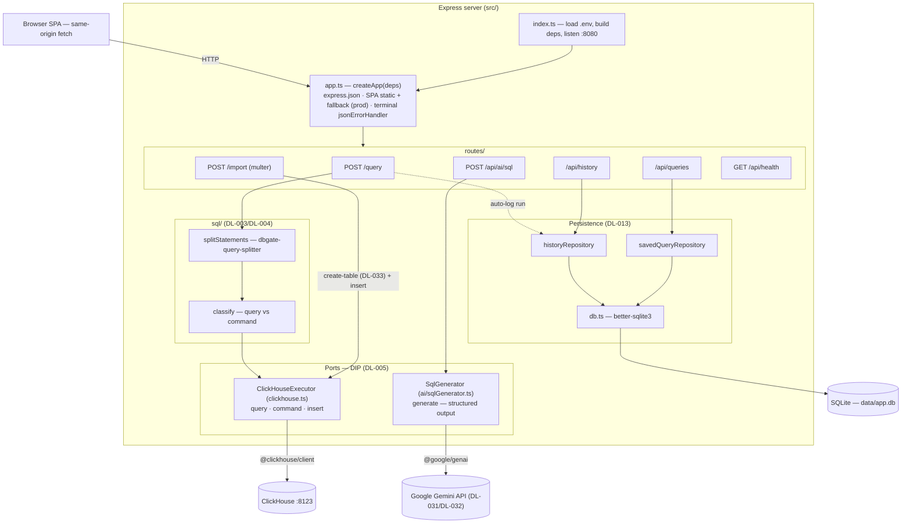
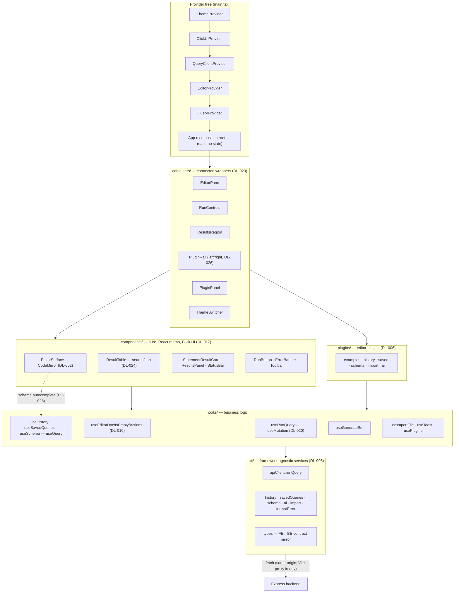
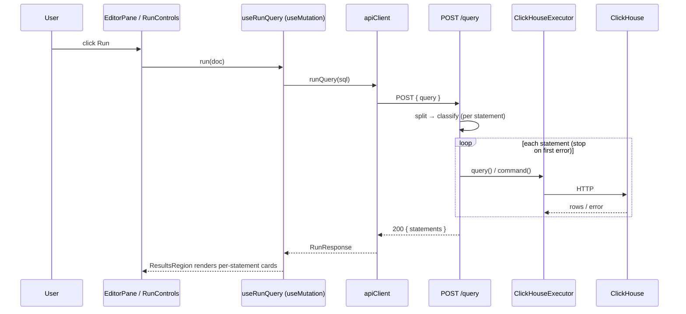

# Architecture

Backend and frontend architecture diagrams for the SQL Editor. Rationale for every choice is in
[`DECISION_LOG.md`](./DECISION_LOG.md) (referenced inline as `DL-xxx`); the plan is
[`IMPLEMENTATION_PLAN.md`](./IMPLEMENTATION_PLAN.md). Diagrams use Mermaid (rendered on GitHub).

The split: the **backend owns all SQL execution semantics** (split → classify → execute, persistence,
LLM proxy) behind narrow injectable **ports**; the **frontend is layered** (pure presentation →
containers → hooks → services) with **server state in TanStack Query** and **UI state in React
Context**, and optional features attach as **editor plugins**.

---

## Backend (`src/`)

Express app factory with dependency injection (DIP) — constructable in tests with no socket/network.
Routes depend only on narrow ports (`ClickHouseExecutor`, `SqlGenerator`) and repository interfaces,
so every collaborator is mockable.

**Notes**
- `POST /query` (DL-004): split the script, classify each statement, execute in order, **stop on
  first error**, return `200 { statements: StatementResult[] }` (per-statement errors are data); rows
  capped server-side. Every run is best-effort auto-logged to history (DL-013), skippable via
  `recordHistory:false` for internal reads like schema (DL-029).
- `POST /api/ai/sql` (DL-031/DL-032): checks `GEMINI_API_KEY` → **503 if unset** *before* calling the
  generator; otherwise Gemini returns structured `{ sql, explanation? }`. Key is server-only.
- The two ports (`ClickHouseExecutor`, `SqlGenerator`) isolate `@clickhouse/client` / `@google/genai`
  to one file each and let routes be tested with fakes (no DB, no API key).

---

## Frontend (`web/src/`)

Four layers with dependencies pointing inward (DL-005): pure **presentation** → connected
**containers** → **hooks** (business logic) → **services** (framework-agnostic IO) → domain types.
UI state lives in split React Context (DL-019/DL-022); server state lives in TanStack Query (DL-020);
optional features attach as **editor plugins** through a registry (DL-006/DL-026).

**Notes**
- **Presentation is pure** (props only, memoized, Click UI); **containers** consume hooks/providers
  and pass plain props down; `App` reads no state, so it never re-renders (DL-023).
- **State by concern (DL-010/DL-019):** the editor document lives in its own Context split into
  `doc` / `isEmpty` / `actions` so typing never re-renders results; theme in `ThemeProvider`.
- **Server state (DL-020):** run-query is a `useMutation` (never cached); history/saved/schema are
  `useQuery` with `invalidateQueries` on mutation. One cached `useSchema` feeds both the schema
  explorer and CodeMirror autocomplete (DL-025).
- **Plugins (DL-006/DL-026):** each is `{ id, toolbarLabel, icon, title, placement, renderPanel }`;
  the icon `PluginRail` (left = sources, right = inspection, DL-028) toggles a `PluginPanel`. Adding a
  feature = registering a plugin; the editor core is untouched (OCP).
- **Contract:** `web/src/api/types.ts` mirrors the backend `RunResponse`/`StatementResult`; every
  service is a thin typed `fetch` throwing `ApiError` on non-2xx.

---

## Request lifecycle — "run a query"

